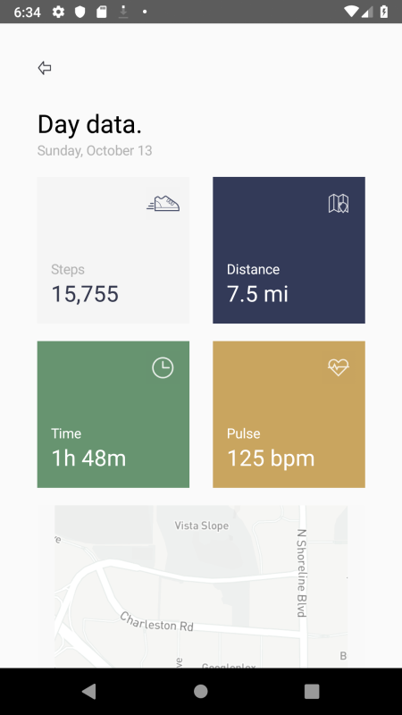
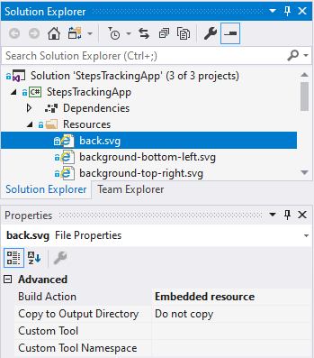

# StepsTrackingApp

A slick steps tracking UI concept built with Xamarin Forms to explore using vector images in an app in cross platform manner.

## Built with
- [FFImageLoading](https://github.com/luberda-molinet/FFImageLoading)
- [Xamarin.Forms](http://xamarin.com/forms)

Original design by [Roman Lel](https://dribbble.com/ozmoweb) via https://dribbble.com/shots/7069277-Steps-Tracking-App.

Details page icons by [Oksana Latysheva](https://thenounproject.com/latyshevaoksana/).

Woman walking drawing by Katerina Limpitsouni via [unDraw](https://undraw.co/).

## Screenshots




## Motivation
Traditional Xamarin Forms apps use raster images placed in the Android and iOS projects. Each platform has it's own requirements for supplying multiple DPI images for their various supported display densities. Often these images are originally drawn in a vector format (lines and curves to form shapes). Instead of exporting this vector image to multiple densities of a raster image, it's possible to display the vector image directly in Xamarin Forms. 

## Using vector images
To achieve this I use (FFImageLoading)[https://github.com/luberda-molinet/FFImageLoading], which supports rendering scalable vector graphics (SVG). This library is a must have for images. SVG support is just one in a long list of helpful features.

To display an SVG image in your app add a reference to the library and an `SvgCachedImage` specifying the location of the image:

```xml
...
<ContentPage
...
xmlns:ffimageloadingsvg="clr-namespace:FFImageLoading.Svg.Forms;assembly=FFImageLoading.Svg.Forms" />

<ffimageloadingsvg:SvgCachedImage Source="location will be set here..." />
```

Since we are using the same file for multiple platforms the vector file can be added a resource in the shared/core project with the rest of the UI.

To do this, add the file to the project and set the *Build Action* to **Embedded resource**:



To reference this file in XAML use `resource://` followed by fully qualified location of the file. In the example above this is StepsTrackingApp.Resources.back.svg:

```xml
<ffimageloadingsvg:SvgCachedImage Source="resource://StepsTrackingApp.Resources.back.svg" />
```

## Map image on details page

In the original concept, there is a stylized image of the map. To get this image, the app requests the phones location then calls a (mapbox)[https://www.mapbox.com/] API. I chose mapbox due to it's simplicity.

To use the API you must supply an API key. Sign up for a key and add it to a new file called ApiKeys. The .gitignore file is setup to ignore this file.